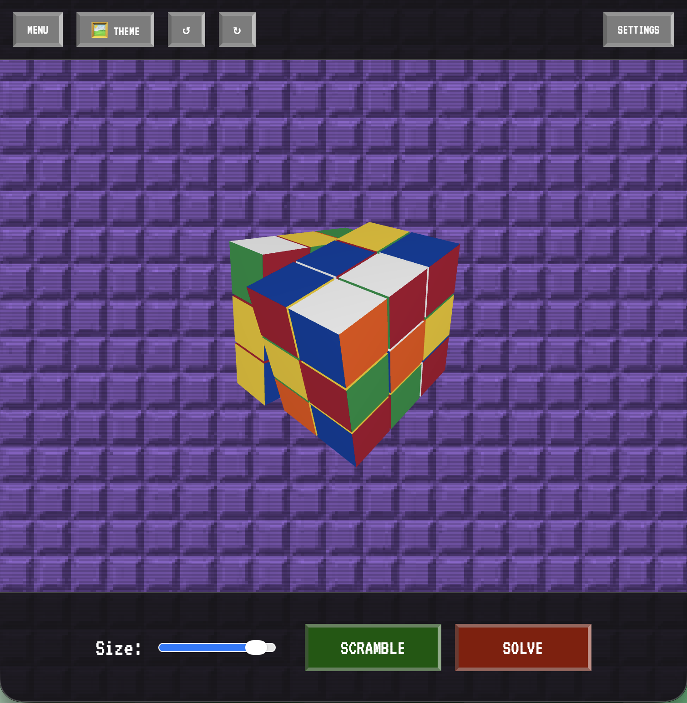

# Retro Cube — Rubik's Solver (Web)

Retro Cube is a retro-styled, browser-based **Rubik’s Cube visualizer and solver** built with **Three.js**. It runs as a simple static site (no build step) and focuses on smooth interactions, a nostalgic UI, and fast cube control.



---

## Features

- **3D cube renderer** powered by Three.js
- **Scramble** and **Solve**
- **Undo / Redo**
- **Reset**
- **Interactive controls**
  - Keyboard turns (with reverse turns)
  - Drag interactions for rotating the view and manipulating the cube (depending on mode)
- **Retro CRT-style UI**
  - Pixel aesthetic
  - Scanlines + subtle noise overlay
- **UI options**
  - Background switching
  - Cube size slider
  - Modes menu (project-specific)

---

## Getting started

### Run locally

Because this project uses ES modules, it’s best to run it via a small local web server (instead of opening `index.html` directly).

#### Option A: Live Server (VS Code / Cursor)

- Install the **Live Server** extension
- Open `index.html` with Live Server

#### Option B: Python

```bash
python3 -m http.server 5173
```

Then open:

- `http://localhost:5173`

#### Option C: Node

```bash
npx serve .
```

---

## Controls

### Keyboard

- **R, L, U, D, F, B**: turn faces
- **Shift + (R/L/U/D/F/B)**: reverse turn
- **Ctrl+Z**: undo
- **Ctrl+Y**: redo

### Mouse / trackpad

- **Drag cube**: rotate a slice / interact with the cube (mode-dependent)
- **Drag background**: rotate the camera/view

---

## Tech stack

- **Three.js** (3D rendering)
- **GSAP** (animations)
- **HTML / CSS / JavaScript** (static site)

---

## Project structure

- `index.html` — app shell + UI layout
- `style.css` — retro styling + CRT effects
- `script.js` — rendering, cube logic, and interactions (main module)
- `*.webp` — background patterns
- `user-icon.png` — UI icon

---

## Adding screenshots later

When you’re ready, you can drop images into the repo (for example: `assets/`) and add something like this near the top:

```md

```

---

## Roadmap (ideas)

- Improved mobile/touch ergonomics
- Solver visibility (move list, notation, step-by-step playback)
- Additional puzzle sizes / variants
- Save/load cube states
- Expanded settings panel


